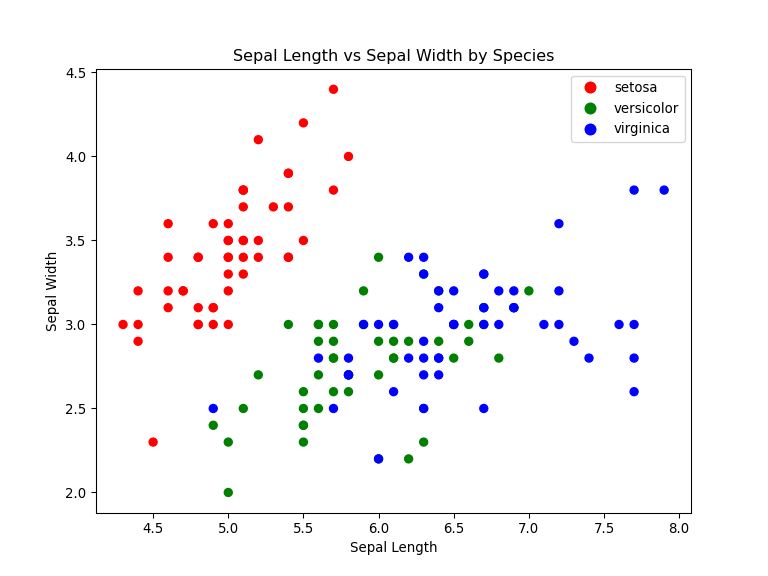

TEST CDS
================

## CDS test for Sorting methods

- In python

``` python
def selection_sort(arr):
    for i in range(len(arr)):
        min_index = i
        for j in range(i+1, len(arr)):
            if arr[j] < arr[min_index]:
                min_index = j
        arr[i], arr[min_index] = arr[min_index], arr[i]
    return arr
  
mylist = [3, 6, 8, 10, 1, 2, 1]

print(selection_sort(mylist))
```

    ## [1, 1, 2, 3, 6, 8, 10]

## Bubble Sort

``` python

def bubble_sort(arr):
    n = len(arr)
    for i in range(n):
        for j in range(0, n-i-1):
            if arr[j] > arr[j+1]:
                arr[j], arr[j+1] = arr[j+1], arr[j]
    return arr
```

## Plot

- Iris data set in R

``` r
library(ggplot2)
data(iris)
ggplot(iris, aes(x = Sepal.Length, y = Sepal.Width, color = Species)) + 
  geom_point()
```

<!-- -->

``` r
write.csv(iris, "iris.csv")
```

- use matplotlib in python

``` python
import matplotlib.pyplot as plt
import pandas as pd
iris = pd.read_csv("iris.csv")
#Define colors for each species
color_map = {
    "setosa": "red",
    "versicolor": "green",
    "virginica": "blue"
}

# Map species to colors
colors = iris["Species"].map(color_map)

# Plot
plt.figure(figsize=(8, 6))
plt.scatter(iris["Sepal.Length"], iris["Sepal.Width"], c=colors)
plt.xlabel("Sepal Length")
plt.ylabel("Sepal Width")
plt.title("Sepal Length vs Sepal Width by Species")
plt.legend(handles=[
    plt.Line2D([0], [0], marker='o', color='w', label='setosa', markerfacecolor='red', markersize=10),
    plt.Line2D([0], [0], marker='o', color='w', label='versicolor', markerfacecolor='green', markersize=10),
    plt.Line2D([0], [0], marker='o', color='w', label='virginica', markerfacecolor='blue', markersize=10)
])
plt.show()
```


